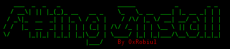

<h1 align="center">
  <br>
  <a href="/logo.png"></a>
</h1>

<h4 align="center">It's A Automation Script Which Will Automatically Install Tools For Bug Hunting/Web-Application Penetration Testing!</h4>


<p align="center">

<a href="https://github.com/0xrobiul/FInstall/issues">

</a>
<a href="https://0xrobiul.me"></a>
<a href="https://twitter.com/0xrobiul"></a>
</p>
      

# Install & Run

F#ing Install requires `go1.17`, `cargo` & `pip3` to install all tools successfully. Run the following command to install the latest version Of all tools.

```sh
wget https://raw.githubusercontent.com/0xrobiul/FInstall/main/f%23; sudo bash f#
```
# It Contains

```console
1)httpx          2)amass
3)ffuf           4)chaos
5)subfinder      6)waybackurls
7)gf             8)uro
9)uncover        10)freq
11)qsreplace     12)sqlmap
13)nuclei        14)nabbu
15)subjack       16)secretfinder
17)arjun         18)byp4xx
19)gau           20)hakrawler
21)dnsx          22)paramspider
23)assetfinder   24)NtHiM
25)tlsx          26)interactsh
```
